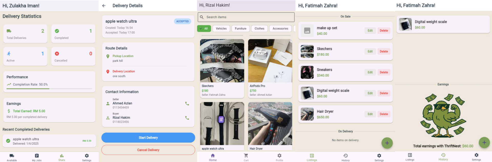

# ThriftNest: Secondhand Marketplace App

This is a secondhand marketplace app developed as part of the CT124-3-2-MAE (Mobile App Engineering) group assignment for the Asia Pacific University (APU) in 2025.

## App Images


## Features

### For Buyers
- **Browse Items**: Discover items across various categories.
- **Search Functionality**: Easily find specific items.
- **Item Details**: View detailed information and images for each product.
- **Shopping Cart**: Add items to a cart for future purchase.
- **User Authentication**: Secure sign-up and login functionality.

### For Sellers
- **Post Items**: List items for sale with details like title, price, description, and images.
- **Manage Listings**: View, update, and remove posted items.
- **Location Picker**: Set a location for item pickup.

### For Couriers
- **View Available Deliveries**: Browse a list of delivery requests.
- **Accept Deliveries**: Accept delivery tasks.
- **Manage Deliveries**: Track and manage accepted deliveries.
- **Delivery Details**: View comprehensive details for each delivery, including pickup and drop-off locations.

## Tech Stack

- **Framework**: Flutter (Dart)
- **Backend**: Firebase
  - **Authentication**: For user sign-up and login.
  - **Cloud Firestore**: As the primary database for items, users, and deliveries.
  - **Firebase Storage**: For hosting user-uploaded item images.
- **Maps and Location**:
  - **Google Maps Flutter**: To display maps for delivery routes.
  - **Geolocator**: For fetching the user's current location.
  - **Geocoding**: To convert coordinates to addresses and vice-versa.

## Getting Started

### Prerequisites

- Flutter SDK (latest stable version)
- Dart SDK (as per Flutter version)
- Android Studio / Xcode (for emulators/simulators)
- A Firebase account and project

### Installation

1.  **Clone the repository:**
    ```sh
    git clone https://github.com/BodhiOng/Secondhand-Marketplace-App.git
    cd Secondhand-Marketplace-App
    ```

2.  **Install dependencies:**
    ```sh
    flutter pub get
    ```

3.  **Set up Firebase:**
    - Create a new Firebase project.
    - Add Android and iOS apps to your Firebase project.
    - Download the `google-services.json` (for Android) and `GoogleService-Info.plist` (for iOS) configuration files and place them in the appropriate directories (`android/app` and `ios/Runner`).
    - Enable Authentication, Firestore, and Storage in the Firebase Console.

4.  **Run the app:**
    ```sh
    flutter run
    ```

## Project Structure
The project is organized into the following main directories under `lib/`:
```
lib/
├── AppLogic/         # Core application logic, including Firebase setup and services
├── BuyerScreens/     # Widgets and screens for the buyer's user flow
├── CommonScreens/    # Shared screens like login, signup, and profile management
├── CourierScreens/   # Widgets and screens for the courier's user flow
├── SellerLogic/      # Business logic and data models for sellers
├── SellerScreens/    # Widgets and screens for the seller's user flow
├── courierLogic/     # Business logic and data models for couriers
├── integration/      # Integration logic, e.g., purchase handling
├── main.dart         # The main entry point of the application
└── Images/           # Static image assets used in the app
```

## Data Models

### Item (`ItemModel`)
-   **id**: Unique identifier for the item.
-   **title**: Name of the item.
-   **price**: Selling price.
-   **description**: Detailed description of the item.
-   **condition**: Condition of the item (e.g., New, Used).
-   **category**: Item category.
-   **location**: Pickup location for the item.
-   **ownerId**: The user ID of the seller.
-   **createdAt**: Timestamp when the item was listed.
-   **imageBase64**: Base64 encoded string of the item's image.
-   **sellingStage**: The current stage of the item in the selling process (e.g., 'On Sale').

### Delivery Request (`DeliveryRequest`)
-   **id**: Unique identifier for the delivery request.
-   **itemId**: The ID of the item to be delivered.
-   **itemTitle**: The title of the item.
-   **sellerId**: The user ID of the seller.
-   **buyerId**: The user ID of the buyer.
-   **pickupAddress**: The address for picking up the item.
-   **deliveryAddress**: The address for delivering the item.
-   **courierId**: The user ID of the courier who accepted the request.
-   **status**: The current status of the delivery (`pending`, `accepted`, `inTransit`, `delivered`, `cancelled`).
-   **createdAt**: Timestamp when the delivery request was created.

## Contributing

Contributions are welcome! If you have suggestions or want to improve the app, please follow these steps:

1.  Fork the repository.
2.  Create your feature branch (`git checkout -b feature/AmazingFeature`).
3.  Commit your changes (`git commit -m 'Add some AmazingFeature'`).
4.  Push to the branch (`git push origin feature/AmazingFeature`).
5.  Open a Pull Request.

## Acknowledgments

-   All contributors who have helped in developing this application.
